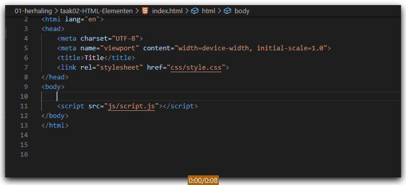
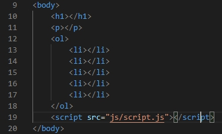

# FRONTEND-ESSENTIALS-2 - 01 - HTML/CSS - Taak 02

## Basic HTML 

### Uitleg

Je kunt Emmet ook gebruiken om snel HTML-elementen in te voegen in een HTML-bestand zoals `index.html`.

:zap: Gebruik `+` om verschillende HTML-elementen op hetzelfde niveau in te voegen.

:zap: Gebruik `>` om elementen binnen een element in te voegen en `*` om het aantal elementen aan te geven.

### Leerdoelen

1. Ik kan mbv Emmet snel HTML elementen toevoegen een een HTML bestand.

### Opdracht

1. Maak mbv Emmet afkortingen de volgende elementen aan in de body van `index.html`
   1. een h1
   2. een p
   3. een orderd list met daarin 5 list items

### Eindresultaat

### :heart: Bronnen

* [Emmet.io](https://www.emmet.io/)  
* [Emmet Cheatsheet](https://docs.emmet.io/cheat-sheet/)