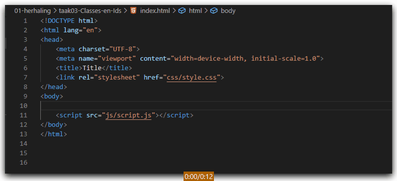

# FRONTEND-ESSENTIALS-2 - 01 - HTML/CSS - Taak 03

## Basic HTML 

### Uitleg

Nu je in de vorige taken hebt geleerd om HTML-elementen in te voegen zijn we aangekomen bij Classes en Id's. Die kun je ook snel aangeven met de bekende `#` voor een id en `.` voor een class.

### Leerdoelen

1. Ik kan met Emmet een class of id toevoegen aan een HTML element

### Opdracht

1. Maak in de body van `index.html` de volgende elementen:
   1. Een header-element met daarin een div met een class genaamd `logo`.
   2. Een main-element met daarin 2 divs met classes genaamd `left` en `right`
   3. Een footer-element met daarin 3 divs met classes genaamd `left`, `middle` en `right`
### Eindresultaat

### :heart: Bronnen

[Emmet.io](https://www.emmet.io/)  
[Emmet Cheatsheet](https://docs.emmet.io/cheat-sheet/)