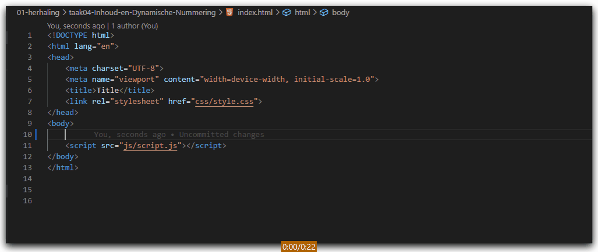

# FRONTEND-ESSENTIALS-2 - 01 - HTML/CSS - Taak 04

## Basic HTML 

### Uitleg

Je heb geleerd hoe je met Emmet snel een HTML element kunt invoegen met daarbij een class of id. In deze taak gaan we nog 3 handigheidjes van Emmet.

Gebruik `{}` om tekst in een HTML element aan te geven.  
Gebruik `$` om een getal toe te voegen aan een HTML element

Zie onderstaande gif. :rocket: letop de preview van de Emmet afkorting!

### Leerdoelen

1. Ik kan met Emmet een Ordered of Unordered List aanmaken met genummerde classes voor elk listitem

### Opdracht

1. Maak een Ordered List met daarin 5 list items. De UL heeft een class genaamd `lijstje` en de LI elementen hebben een class genaamd `item1`, `item2`, etc. 

### Eindresultaat

### :heart: Bronnen

[Emmet.io](https://www.emmet.io/)  
[Emmet Cheatsheet](https://docs.emmet.io/cheat-sheet/)