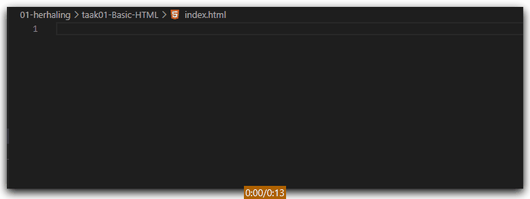
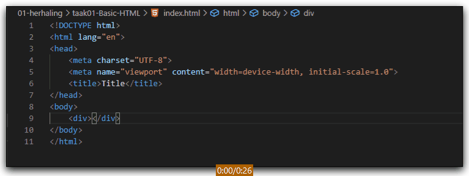
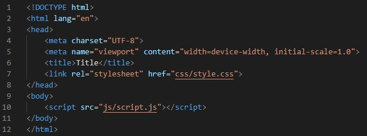

# FRONTEND-ESSENTIALS-2 - 01 - Herhaling - Taak 01

## Basic HTML 

### Uitleg

Je hebt in voorgaande modules geleerd hoe je een basis template maakt in een html bestand zoals `index.html`. Dit soort handelingen zal je vaak uitvoeren en het is daarom handig om te weten hoe je dit zo snel mogelijk doet zonder telkens te moeten copy/pasten uit oude bestanden.

VS code kan veel voor je doen om dit soort herhalende taken sneller uit te voeren. In onderstaande gif zie je hoe je snel een basis template maakt en met `TABS` snel naar de juiste plek gaat.

Dit geldt ook voor het linken van een extern CSS en Javascript bestand. Je kunt dus volstaan met het schrijven van een afkorting die dan door een `TAB` wordt ingevuld voor je. Je cursor staat daarna ook precies op de plek waar je wilt zijn om de naam van het te linken bestand verder in te vullen. Deze omvorming van een afkorting naar een volledig element worden verzorgt binnen VS Code door Emmet. Dit is een plugin die standaard wordt meegeleverd bij VS Code, zie [Bronnen](#bronnen).

### Leerdoelen

1. Ik kan een HTML template met links naar externe bestanden maken door gebruik te maken Emmet afkortingen.

### Opdracht

1. Maak in `index.html` een basic HTML template aan met links naar `css/style.css` en `js/script.js`.  
   :zap: vermijd het gebruik van je muis/touchpad en maak gebruik van Emmet afkortingen.

### Eindresultaat

Onderstaande code in `index.html`.

### Bronnen

[Emmet.io](https://www.emmet.io/)