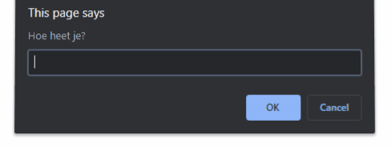
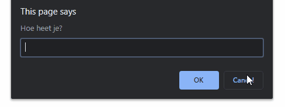

# FRONTEND-ESSENTIALS-2 - 02-Javascript - Taak01

## Herhaling
### Uitleg

Je hebt in de voorgaande modules geleerd hoe je variabelen declareert. Daarna heb je geleerd hoe je waardes opslaat in een variabele. Je hebt ook geleerd hoe je de gebruiker d.m.v. een prompt om input kunt vragen. In deze taak gaan we de tekst die een gebruiker invoert, opslaan in een variabele. 

#### Variabelen en console.log()
```js
let strTest; //declareer een variabele genaamd strTest
strTest = "Hallo"; //ken de waarde "Hallo" toe aan de strTest variabele
console.log(strTest); //toon de waarde in de console van de developer tools in je browser
```

#### Alert-boxes
```js
// vraag de gebruiker om zijn naam
prompt("Hoe heet je?"); 

// vraag de gebruiker om zijn naam én sla de opgegeven naam op in strNaam
strNaam = prompt("Hoe heet je?");

// toon een alertbox. Gebruiker kan alleen op OK drukken. Let op de string samenvoeging.
alert("Je heet " + strNaam); 

// toon een-confirm box (gebruiker kan op OK of Cancel drukken). Als de gebruiker op OK drukt, wordt er TRUE opgeslagen in de boolNaamCorrect variabele. Als Cancel dan FALSE.
boolNaamCorrect = confirm("Heet je echt" + strNaam +"?"); 
```

#### If/Else-statement
```js
if(test == "Hallo"){ 
    //conditie tussen de () is TRUE, voer code hier uit
}
else{
    //conditie tussen de () is FALSE, voer code hier uit
}
```
### Leerdoelen

1. Ik kan de prompt(), alert() en confirm() dialog boxes gebruiken om een gebruiker informatie te vragen en de ingevoerde informatie opslaan in een variabele. 
2. Ik kan if/else statement gebruiken om de flow van een programma te bepalen.

### Opdracht

1. Er is een `index.html` met gelinkte CSS en Javascript bestanden voor je aangemaakt. Zorg ervoor dat wanneer je dit bestand opent in je browser het volgende gebeurt:
   1. De bezoeker wordt gevraagd om zijn naam d.m.v. een prompt-box en de waarde die de bezoeker invult in de prompt wordt opgeslagen in de variabele `strNaam`.
   2. Daarna wordt de bezoeker gevraagd d.m.v. een confirmbox of de gebruiker echt heet zoals hij heeft ingevuld. De waarde die je terugkrijgt van de confirmbox wordt opgeslagen in `boolNaamKlopt`.
   3. Daarna check je in je code met een if/else-statement of de gebruiker bevestigd heeft in stap2 dat de naam klopt. Klopt de naam? Toon dan een alertbox met een welkombericht. Klopt de naam niet? Vraag dan aan de gebruiker nog een keer om zijn naam. Check weer of de ingevulde naam klopt en zo ja, toon een welkom-alertbox. Zo niet, toon dan een alertbox met een passende tekst.

:rocket: **TIP**: je zal twee if/else-statements moeten schrijven. De tweede if/else staat in de else van de 1ste if/else. Beetje moeilijke zin misschien, maar als je deze opdracht goed hebt afgerond snap je wat er staat ;)

:rocket: **TIP2**: gebruik `console.log()` om variabelen te tonen in de developer tools van je browser zodat je kan checken of je de juiste waardes in de juiste variabelen opslaat. 


### Eindresultaat

Gebruiker vult zijn naam goed in en bevestigt dit ook.

> 

Gebruiker vult zijn naam in maar bevestigt dit niet, tweede keer lukt wel.

> 

Gebruiker vult zijn naam twee keer in en zegt twee keer dat het niet goed is.

> 

### :heart: Bronnen

* [W3S - Javascript Data Types](https://www.w3schools.com/js/js_datatypes.asp)  
* [W3S - JavaScript if else](https://www.w3schools.com/js/js_if_else.asp)  
* [W3S - Window prompt() Method](https://www.w3schools.com/jsref/met_win_prompt.asp)  
* [W3S - Window confirm() Method](https://www.w3schools.com/jsref/met_win_confirm.asp)  
* [W3S - Window alert() Method](https://www.w3schools.com/jsref/met_win_alert.asp)
