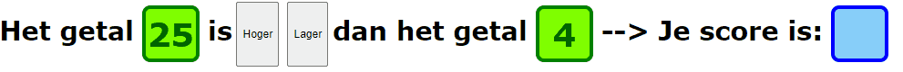

# FRONTEND-ESSENTIALS-2 - 02-Javascript - Taak04

## Functions

### Uitleg

Als je de vorige taken allemaal goed hebt uitgevoerd dan heb je alle basis blokken gebruikt die een complexere javascript applicatie mogelijk maken.

Er staat een half afgemaakt simpel spelletje klaar in de bronbestanden van deze taak. Aan jouw de taak om de code werkend te krijgen. Een deel van de code staat al voor je klaar  maar je bent vrij om je eigen oplossing te verzinnen.

### Leerdoelen

1. Ik kan een

### Opdracht

1. Zorg ervoor dat de de onderstaande dingen werken:
   1. Als je de pagina voor de eerste keer opent verschijnen er twee random getallen in de groene blokjes.
   2. Op het moment dat je knop `hoger` of `lager` klikt wordt er gechecked of de zin klopt. Dus als het eerste getal hoger is dan het tweede getal en je drukt op de knop `hoger` dan klopt de zin en andersom.
   3. Als je de zin kloppend maakt door op een van de knoppen te drukken krijg je een punt. Dit hou je bij in een variabele genaamd `score`. Op het moment dat je het foute antwoord geeft gaat er een punt af. De waarde van `score` wordt getoond in het blauwe blokje.
   4. Elke keer dat je een van de twee knoppen indruk worden er nadat er gekeken wordt of je de goede knop hebt ingedrukt twee nieuwe random getallen getoond.
   5. Zorg ervoor dat de achtergrond kleur van pagina groen wordt als je de goede knop hebt ingedrukt en rood als je de verkeerde knop hebt ingedrukt.

### Eindresultaat

### Bronnen

[W3S Javascript Function Parameters](https://www.w3schools.com/js/js_function_parameters.asp)