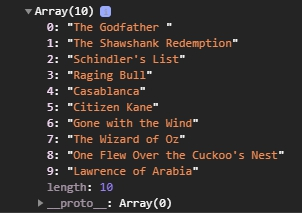

# FRONTEND-ESSENTIALS-2 - 02-Javascript - Taak08

## Arrays

### Uitleg

In deze taak gaan we nog wat meer oefenen met het ophalen van gegevens uit een array.

In `script.js` is de topFilms-array gemaakt met daarin de top 10 films allertijden volgens de Internet Movie Database. Als je de pagina opent in je browser en in devtools je console opent zie het array object met daarin de waardes en daarvoor de index van de array. 

:zap: Voor de leesbaarheid is de code die de array definieert in `script.js` verdeeld over meerdere regels.

Er is ook een tabel voor je gemaakt met daarin de informatie uit de array, deze wordt gevuld vanuit `script.js`.

### Leerdoelen

1. Ik kan een willekeurige waarde ophalen uit een array.

### Opdracht

1. Schrijf code die het volgende doet:
   1. Vraag met een prompt aan de gebruiker het nummer van zijn favoriete film.
   2. Toon de **naam** van de gekozen film in de console.
   3. Verander de achtergrondkleur van de gekozen film naam in blauw en de voorgrondkleur naar wit in de tabel.
   4. :warning: LETOP: zorg ervoor dat alle films gekozen kunnen worden en dat de getoonde naam in de console overeenkomt met de film die een blauwe achtergrond krijgt in de tabel.
   5. :rocket: Je kunt natuurlijk een getal opgegeven groter dan 10. Je krijgt dan een error als je de waarde met een index groter dan de lengte van de array probeer op te halen. Zorg ervoor dat je checkt of de waarde die de gebruiker opgeeft wel tussen de 1 en 10 is. Ook als de gebruiker op cancel drukt verschijnt er een error in de console. Zoek ook hier een slimme oplossing voor in je code.

### Eindresultaat

### :heart: Bronnen

* [W3S Javascript Arrays](https://www.w3schools.com/js/js_arrays.asp)
* [Javascript.info Arrays](https://javascript.info/array)