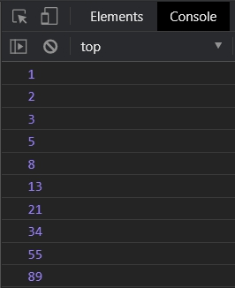

# FRONTEND-ESSENTIALS-2 - 02-Javascript - Taak13

## Loops

### Uitleg

De Fibonaccireeks is een speciale reeks getallen waarbij elk volgende getal in de reeks de som is van de twee voorgaande getallen. 

### Leerdoelen

1. Ik kan elementen toevoegen aan een array vanuit een for-loop 

### Opdracht

1. Maak een for-loop die de volgende getallen in de console toont: `1,2,3,5,8,13,21`.

### Eindresultaat

### :heart: Bronnen

[W3S Javascript Arrays](https://www.w3schools.com/js/js_arrays.asp)  
[W3S Javascript Array push() method](https://www.w3schools.com/jsref/jsref_push.asp)