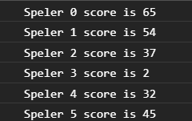

# FRONTEND-ESSENTIALS-2 - 02-Javascript - Taak15

## Loops

### Uitleg

Vaak gebruik je loops in combinatie met een array. Omdat je soms niet weet hoeveel elementen een array bevat geef je dan in je for loop aan dat het aantal keer dat de loop moet worden uitgevoerd afhankelijk is van de lengte van de array. Je gebruikt daar voor de `array.length` property.

```js
for (let i = 0; i < array.length; i++) {
    
}
```
Je kan zo bijvoorbeeld bij een bestaande array door alle elementen lopen en een berekening uitvoeren op de elementen. Zie code hieronder waarbij bij alle waardes uit een array het getal 1 wordt opgeteld.

```js
var voorbeeldArray = [1,2,3,4];

for (let i = 0; i < voorbeeldArray.length; i++) {
    voorbeeldArray[i] += 1;
    console.log(voorbeeldArray[i]);
}
// In de console worden nu de waardes 2,3,4 en 5 onder elkaar getoond. 
// De voorbeeldArray ziet er dus zo uit aan het einde van de for loop: [2,3,4,5].
```

Stel je bent een multiplayer spel aan het maken. Er kunnen tussen de 3 en 10 spelers tegelijk spelen. Het spel bestaat uit meerdere rondes en de score van de speler worden bijgehouden in een array. Na elke ronde in ons denkbeeldige spel hebben alle spelers een aantal punten verdiend en je wilt deze optellen bij het totaal aantal punten per speler. Omdat je van te voren niet precies weet hoeveel spelers er meespelen ga je uit van de lengte van de `spelersScore` array. 


### Leerdoelen

1. Ik kan door een array loopen en een berekening uitvoeren op de waardes in de array.

### Opdracht

1. Schrijf een for loop die door de `spelersScore` array loopt en voor elk element in die array het aantal punten optelt uit de `rondePunten` array optelt. Toon de output zoals die te zien is bij het kopje [Eindresultaat](#eindresultaat).
> :warning: LETOP: Elke keer dat je pagina ververst zal er een willekeurig aantal spelers te zien zijn.

### Eindresultaat



of bijvoorbeeld:


### :heart: Bronnen

* [W3S Javascript For Loop](https://www.w3schools.com/js/js_loop_for.asp)
* [W3S Javascript String Methods](https://www.w3schools.com/js/js_string_methods.asp)  
* [W3S Javascript Arrays](https://www.w3schools.com/js/js_arrays.asp)  
* [W3S Javascript Array push() method](https://www.w3schools.com/jsref/jsref_push.asp)