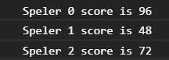

# FRONTEND-ESSENTIALS-2 - 02-Javascript - Taak16

## Loops

### Uitleg

### Leerdoelen

1. Ik kan 

### Opdracht

1. Schri

### Eindresultaat

of bijvoorbeeld:

### :heart: Bronnen

* [W3S Javascript For Loop](https://www.w3schools.com/js/js_loop_for.asp)
* [W3S Javascript String Methods](https://www.w3schools.com/js/js_string_methods.asp)  
* [W3S Javascript Arrays](https://www.w3schools.com/js/js_arrays.asp)  
* [W3S Javascript Array push() method](https://www.w3schools.com/jsref/jsref_push.asp)