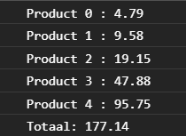

# FRONTEND-ESSENTIALS-2 - 02-Javascript - Taak16

## Loops

### Uitleg

Je kunt een loop ook uitvoeren binnen een andere loop. Onderstaande code toont de tafels tot en met 10 in de console.

```js
for (let i = 0; i <= 10; i++) {
    for (let j = 0; j <= 10; j++) {
        console.log(i + " x " + j + " = " + i*j); //toont b.v. 3 x 4 = 12
    }
}
```
Dit kan handig zijn als je bijvoorbeeld door een array wilt loopen en meerdere handelingen wilt uitvoeren op elk element van de array. 
> :warning: De buitenste loop gebruikt als conventie (standaard) de variabel `i` als index. Elke loop daarbinnen gebruikt opeenvolgende letter in het alfabet, in dit geval dus `j` en een loop daarbinnen gebruikt `k`, etc. Onderstaand voorbeeld vermenigvuldigt de waardes in een array met de waardes uit een andere array en toont deze in de console.

```js
var arrEen = [1,2,3];
var arrTwee = [1,2,3];

for (let i = 0; i < arrEen.length; i++) {
    for (let j = 0; j < arrTwee.length; j++) {    
        console.log(arrEen[i] * arrTwee[j])
    }
    console.log("---");
}
//output in de console:
1
2
3
---
2
4
6
---
3
6
9
---
```

Stel je hebt een online winkel. De gebruiker heeft een aantal producten in zijn winkelwagen gezet. Op dit type product is een korting van toepassing van 5 procent. Daarnaast is het Black Friday en heeft de gebruiker recht op nog eens 15% korting. En de gebruiker heeft een kortingscode ingevuld waarmee hij nog eens 2 procent korting krijgt op het gehele assortiment. Uiteindelijk, na het toepassen van de kortingen moet er 20 procent btw worden bijgerekend om zo tot het eindbedrag te komen per product en in totaal.

De gegevens over de prijzen van de producten en welke kortingen / btw moeten worden toegepast op al die producten komen uit een database maar zijn voor het gemak alvast in `script.js` in twee arrays voor je gezet. 

### Leerdoelen

1. Ik kan een loop maken in een andere loop.

### Opdracht

1. Schrijf een dubbele for loop waarmee je door `arrProductPrijsen` array loopt en de kortingen en btw toepast uit de `arrProductKorting` array. Voor het gemak zijn de waardes uit deze array al omgezet naar een waarde die je in je berekening kunt gebruiken (De berekening voor het toepassen van 5 procent korting is hetzelfde als de prijs vermenigvuldigen met 0.95 bijvoorbeeld).
2. Sla het totaal van alle producten na de toepassing van alle kortingen en btw op in de `totaal` variabele en toon deze in de console.
3. Gebruik de `rondaf()` functie om het de prijsen af te ronden op twee decimalen. Zie [Eindresultaat](#eindresultaat) voor een voorbeeld van de output in de console.

### Eindresultaat



### :heart: Bronnen

* [W3S Javascript For Loop](https://www.w3schools.com/js/js_loop_for.asp)
* [W3S Javascript String Methods](https://www.w3schools.com/js/js_string_methods.asp)  
* [W3S Javascript Arrays](https://www.w3schools.com/js/js_arrays.asp)  
* [W3S Javascript Array push() method](https://www.w3schools.com/jsref/jsref_push.asp)