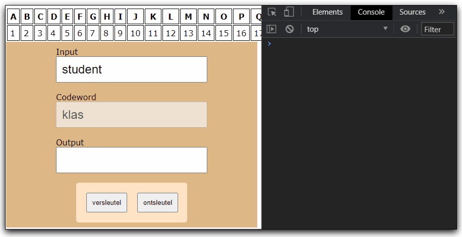

# FRONTEND-ESSENTIALS-2 - 02-Javascript - Taak14

## Loops

### Uitleg

> :warning: Als je de onderstaande tabellen niet goed kan zien open dan deze README.md in VS Code en gebruik de Markdown preview: <kbd>CTRL</kbd>+<kbd>SHIFT</kbd>+<kbd>V</kbd>. Of gebruik <kbd>CTRL</kbd>+<kbd>K</kbd><kbd>V</kbd> om de preview meteen te openen in een naastliggend venster. 

Een gemakkelijke manier om een woord te versleutelen is door alle letters één of meer plaatsen op te schuiven in het alfabet. Als we bijvoorbeeld elke letter in het woord `BOOM` 1 plaats verschuiven dan krijg je `CPPN` als versleuteld bericht.

Bericht | B | O | O | M
-- | --|--|--|--
Versleuteld bericht | C | P | P | N

#### Iets ingewikkelder

Dit is wel een heel gemakkelijk voorbeeld. We kunnen het wat moeilijker maken door een elke letter een verschillende aantal plaatsen op te schuiven. Stel we verschuiven de 1ste letter 1 plek op, de 2e letter 2 plekken, de 3e letter 3 plekken, etc.

Bericht | B | O | O | M
-- | --|--|--|--
Aantal plekken opschuiven | 1 | 2 | 3 | 4
Versleuteld bericht | C | Q | R | P

De verzender en de ontvanger hoeven nu alleen de getallen 1234 te weten om het bericht te kunnen versleutelen en te ontsleutelen. Je zou dit ook anders kunnen doorgeven, in de vorm van een woord. In dit geval zou het woord ABCD zijn. A=1, B=2, etc. Om het wat realistischer te maken kunnen we ook een *echt* woord gebruiken natuurlijk. Stel we nemen een ander vierletterig woord als **codewoord**: KLAS.

Het omzetten van de letter B gaat dan als volgt:
1. Bepaal de positie van de letter B in het alfabet -> 2.
2. Bepaal de positie van de overeenkomende letter in het codewoord en de positie daarvan in het alfabet: K -> 11
3. Tel beide getallen op (2 + 11 = 13). De versleutelde letter is dan de letter die op positie 13 staat in het alfabet -> M.

#### Codewoord gebruiken

Bericht | B | O | O | M
-- | --|--|--|--
Plek in het alfabet | 2 | 15 | 15 | 19
Codewoord | K | L | A | S
Plek in het alfabet | 11 | 12 | 1 | 19
Nieuwe letter plek in het alfabet | 13 | 27 | 16 | 38
Versleuteld bericht | M | ? | P | ?

```js
var voorbeeldString = "Dit is een array van letters";
voorbeeldString[0]; //geeft terug: D
```
Net als een array ziet Javascript een string als een object. En net zoals je bij een array de method `array.push()` kunt gebruiken om een element toe te voegen aan een array kun je ook verschillende methods gebruiken om strings te manipuleren.

```js
var voorbeeldString = "Dit is een array van letters";
voorbeeldString.length; // geeft terug: 28 (spaties worden meegeteld)
```

Misschien valt je al op dat dit voorbeeld niet meer werkt als je een bericht hebt dat groter is dan het codewoord. De oplossing hiervoor is simpelweg het herhalen van het codewoord:

Bericht | S | T | U | D | E | N | T
-- | --|--|--|-- | -- | -- | -- 
Codewoord | K | L | A | S | K | L | A
Bericht plek in het alfabet | 19 | 20 | 21 | 4 | 5 |14 | 20
Berekening | + | + | + | + | + | + | +
Codewoord plek in het alfabet | 11 | 12 | 1 | 19 | 11 | 12 | 1
-- | = | = | = | = | = | = | =
Positie versleutelde letter | 30 | 32 | 22 | 23 | 16 | 26 | 21
Groter dan 26? -26! | 4 | 6 | 22 | 23 | 16 | 26 | 21
Versleutelde letter | D | F | V | W | P | Z | U 

#### Ontsleutelen

Je kunt nu het versleutelde bericht DFVWPZU delen met iemand en die zal in combinatie met het codewoord KLAS het bericht moeten kunnen ontsleutelen. In de tabelvorm zoals hierboven ziet dat er zo uit:

Versleuteld bericht (STUDENT) | D | F | V | W | P | Z | U 
-- | --|--|--|-- | -- | -- | -- 
Codewoord | K | L | A | S | K | L | A
Positie versleutelde letter | 4 | 6 | 22 | 23 | 16 | 26 | 21
Berekening | - | - | - | - | - | - | -
Codewoord positie | 11 | 12 | 1 | 19 | 11 | 12 | 1
-- | = | = | = | = | = | = | =
Bericht positie | -7 | -6 | 21 | 4 | 5 |14 | 20
Negatief getal? + 26! | 19 | 20 | 21 | 4 | 5 | 14 | 20
Bericht | S | T | U | D | E | N | T

De eerste 2 kolommen hebben als positie een negatief getal! Om dit toch goed om te zetten naar de ontsleutelde letter moet je er 26 bij optellen.
> Om de letter D te ontsleutelen met de letter K zoals gebeurt in de meest linker kolom:  
> positie letter D - positie letter K + 26 = positie van de ontsleutelde letter  
> DUS: 4 - 11 = -7 en -7 + 26 = 19 en de letter met positie 19 is S.

### Leerdoelen

1. Ik kan functies met argumenten en return waarden toepassen
2. Ik kan een for loop gebruiken om door een array te lopen en berekeningen uitvoeren op de waarden van een array
3. Ik kan mijn code opdelen in functies om zo overzichtelijke begrijpbare code te schrijven
### Opdracht

Er is een deel van de code al voor je aangemaakt in `script.js`. Er zijn 3 stukken die nog moeten worden aangepast zodat de applicatie werkt zoals te zien is bij [Eindresultaat](#eindresultaat).

1. Opdracht 1. Zie regel 29 in `script.js`: Maak de `positiesNaarString` functie af. Deze lijkt heel erg op de `stringNaarPosities` functie.
2. Opdracht 2. Zie regel 44 in `script.js`: Maak de `vermenigvuldigCodeword` functie af. Een deel van de functie bestaat al, aan jou om met 2 losse for-loops een correcte string terug te geven. Zie commentaar boven de functie.
3. Opdracht 3. De `versleutel` functie versleuteld een opgegeven bericht. Maak de `ontsleutel` functie af.

> :rocket: Maak gebruik de van de `console.log` statements die al in de code staan of schrijf je eigen statements. En Gebruik <kbd>CTRL</kbd>+<kbd>/</kbd> om een regel code om te zetten naar commentaar en andersom.

> :rocket: Probeer stapje voor stapje de code die je schrijft te begrijpen en kijk of het werkt zoals je denkt door `console.log` te gebruiken.
### Eindresultaat



### :heart: Bronnen

[W3S Javascript String Methods](https://www.w3schools.com/js/js_string_methods.asp)  
[W3S Javascript Arrays](https://www.w3schools.com/js/js_arrays.asp)  
[W3S Javascript Array push() method](https://www.w3schools.com/jsref/jsref_push.asp)